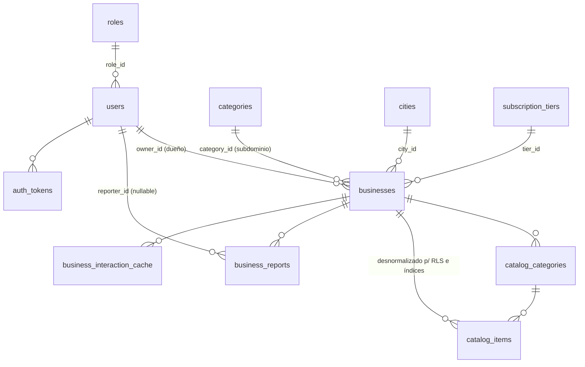

# eneleje.com — Arquitectura técnica

> Directorio comercial dinámico, auto-mantenido y georreferenciado para la reactivación
> económica local tras emergencias y sismos. Versión 1.0 — 2026-08-29.

---

## 1. Visión general

```
                        ┌──────────────────────────────────────────────┐
                        │                 CLOUDFLARE                   │
                        │  DNS wildcard *.eneleje.com · SSL · CDN/WAF   │
                        │  Rate limiting L7 · Turnstile (anti-bot)      │
                        └───────────────┬──────────────────────────────┘
                                        │ HTTPS (Full Strict)
                        ┌───────────────▼───────────────┐
                        │        NGINX (reverse proxy)  │  limit_req / limit_conn
                        │  Extrae Host → X-Subdomain    │  headers de seguridad
                        │  TLS wildcard · gzip · cache  │
                        └───────────────┬───────────────┘
                                        │ HTTP interno (red docker "internal")
          ┌─────────────────────────────▼───────────────────────────────┐
          │                    NEXT.JS (Node 20, standalone)            │
          │  ┌───────────────┐  ┌──────────────────┐  ┌──────────────┐  │
          │  │ Middleware TS │→ │ Server Components │  │ Server Actions│ │
          │  │ sub→categoría │  │ (RSC, listing/map)│  │ (CRUD, track) │ │
          │  └───────────────┘  └──────────────────┘  └──────────────┘  │
          └──────────┬──────────────────────────────┬───────────────────┘
                     │ Drizzle ORM / SQL nativo     │ ioredis / Upstash
          ┌──────────▼──────────┐        ┌──────────▼──────────┐
          │  PostgreSQL 16      │        │  Redis 7            │
          │  + PostGIS 3.4      │        │  rate limit · caché  │
          │  GiST · KNN · RLS   │        │  contadores analítica│
          └─────────────────────┘        └─────────────────────┘
                     │
          ┌──────────▼──────────┐
          │  Cloudflare R2 / S3 │  fotos de perfil, catálogo y menús → WebP
          └─────────────────────┘
```

**Principios rectores**

1. **Velocidad en móvil inestable**: HTML servido desde Server Components cacheable, JS mínimo,
   imágenes WebP/AVIF vía R2 + Cloudflare, mapas con carga diferida (dynamic import).
2. **Publicación inmediata, moderación después**: el registro crea el negocio en `published`;
   la calidad se garantiza con reportes comunitarios + umbrales automáticos + rate limiting.
3. **El subdominio ES la categoría**: la categoría principal única del negocio determina el
   subdominio; la ciudad va por path. Cero configuración por tenant: todo se resuelve en runtime
   contra dos tablas diminutas (`categories`, `cities`) cacheadas en Redis/`unstable_cache`.
4. **Analítica barata**: contadores en Redis (write en O(1)), flush diario a una tabla agregada
   por día, purga automática a los N días. Nunca un insert por evento en Postgres en caliente.

---

## 2. Modelo de enrutamiento multi-tenant dinámico

### 2.1 Contrato de URLs

| URL pública | Ruta interna Next.js | Contenido |
|---|---|---|
| `eneleje.com` / `www.eneleje.com` | `/` | Home: buscador, categorías, ciudades |
| `eneleje.com/registro` | `/registro` | Auto-registro de comercio |
| `eneleje.com/panel` | `/panel` | Panel del dueño (perfil, catálogo, métricas) |
| `eneleje.com/admin` | `/admin` | Panel SuperAdmin / Moderador |
| `panaderias.eneleje.com` | `/c/panaderias` | Landing de categoría (selector de ciudad + listado nacional) |
| `panaderias.eneleje.com/pereira` | `/c/panaderias/pereira` | Listado + mapa de la categoría en la ciudad |
| `panaderias.eneleje.com/pereira/la-espiga-dorada` | `/c/panaderias/pereira/[negocio]` | Perfil público del negocio |
| `eneleje.com/n/{qr_token}` | `/n/[token]` | Resolución de QR físico (atribuye `qr_scan`) |

Implementada con una ruta opcional catch-all: `app/(catalogo)/c/[categoria]/[[...rest]]/page.tsx`.

**Subdominios reservados** (nunca son categorías): `www, app, admin, api, auth, cdn, static,
assets, img, mail, blog, docs, status, help, panel, dashboard, mod, dev, staging, test`.
La lista vive en `src/middleware.ts`; los slugs de `categories` se validan contra ella al crear
categorías (además del constraint de formato en BD).

### 2.2 Flujo de resolución (request lifecycle)

```
GET panaderias.eneleje.com/pereira?orden=cerca
  1. Cloudflare → proxy → Nginx (TLS wildcard, limit_req)
  2. Nginx: proxy_set_header Host $host; X-Subdomain $subdomain  → app:3000
  3. middleware.ts: parsea Host → subdominio "panaderias"
     → rewrite interno a /c/panaderias/pereira + header x-category-subdomain
  4. RSC de /c/[categoria]/[[...rest]]:
     - valida slug de categoría y ciudad (cache Redis 24 h / unstable_cache)
     - categoría inexistente → redirect 302 a https://eneleje.com/buscar?q=panaderias
     - consultas PostGIS (ver §4) → HTML estático por ciudad (ISR 5 min) + mapa MapLibre
```

El middleware corre en Edge (barato, sin I/O): **nunca consulta la BD**; la validación de que el
subdominio es una categoría real ocurre en la página (con caché), que puede hacer redirect.

### 2.3 Middleware y Nginx

- `src/middleware.ts` — parser de Host tolerante a puertos (dev: `panaderias.localhost:3000`),
  lista de reservados, rewrite a `/c/{categoria}/{...path}`, loop-protection (`/c/` ya reescrito).
- `infra/nginx/conf.d/eneleje.conf` — wildcard `server_name eneleje.com *.eneleje.com`,
  `map $host $subdomain`, reenvío de `X-Forwarded-Host`, rate-limit zones diferenciadas
  (general / api / auth / tracking), caché inmutable de `/_next/static`, headers de seguridad.

### 2.4 DNS y TLS

- **Cloudflare**: zona `eneleje.com`, registros `A/AAAA @` + `CNAME *` proxied (nube naranja).
- **SSL comodín**: certificado **Origin CA de Cloudflare** (gratis, 15 años) instalado en Nginx y
  modo SSL "Full (strict)". Alternativa sin Cloudflare: Let's Encrypt **DNS-01** con
  `certbot-dns-cloudflare` (HTTP-01 no cubre wildcards).
- Si detrás de Cloudflare: activar `real_ip` en Nginx con `CF-Connecting-IP` para que el rate
  limiting no agregue por IP de Cloudflare (bloque incluido, comentado).

---

## 3. Modelo de datos



Decisiones clave (los DDL completos están en `db/migrations/`):

- **`businesses.geom geography(Point,4326) NOT NULL`**: geography (no geometry) porque el modelo
  de negocio es "distancia en km sobre la Tierra"; PostGIS devuelve metros con `ST_Distance`
  sin tocar fórmulas de haversine. Las ciudades guardan `geom` de centroide + `bbox` para
  `fitBounds` del mapa.
- **`UNIQUE (city_id, slug)` en businesses**: el slug del negocio es único dentro de su ciudad,
  lo que habilita la URL canónica `categoria.eneleje.com/{ciudad}/{negocio}`.
- **`businesses.status`**: `published | suspended | blocked | closed_by_owner`. Publicación
  inmediata ⇒ `DEFAULT 'published'`. La suspensión automática por reportes usa
  `suspended_until` (72 h por defecto) y el job `reactivate_expired_suspensions()`.
- **`contingency_status`**: `normal | delivery_only | closed_damage | collection_center | unknown`,
  con `contingency_note` y `contingency_updated_at` (dato estrella en emergencias; se muestra
  como chip de color en listados y mapa).
- **`business_interaction_cache (business_id, day, interaction_type) PK`**: agregado diario,
  no eventos crudos. Escribir es un `INSERT ... ON CONFLICT hits+1` (o flush masivo desde Redis).
  `BRIN(day)` hace la purga casi gratis. Índice `(business_id, day DESC)` alimenta el panel.
- **`business_reports.reporter_ip_hash`**: `hmac-sha256(ip + PEPPER)`; nunca IP cruda (privacidad),
  pero suficiente para anti-abuso y para contar "reportantes distintos".
- **`subscription_tiers`**: límites declarativos (`max_photos`, `max_catalog_items`, `ads_free`,
  `has_badge`, `features jsonb`) que la app aplica; `NULL` = ilimitado. Migrar Free→Premium es
  cambiar `businesses.tier_id`.
- **`system_settings`** (k/v jsonb): umbrales de reportes, horas de suspensión, retención de
  analítica, límites anti-spam. Configurables en caliente desde `/admin`.
- **`auth_tokens`**: tokens de verificación de email / reset de contraseña, guardados solo como
  sha256 (el valor plano viaja únicamente por email).

### Seguridad a nivel de fila (RLS)

La app se conecta como `eneleje_app` (no owner, sin DDL). Cada request de Server Action abre
transacción con `SET LOCAL app.user_id = '...'` y `SET LOCAL app.role = '...'`; las policies
(`004_rls_policies.sql`) conceden:

- lectura pública solo de negocios `published` (con expiración de suspensión evaluada inline),
- al dueño, gestión exclusiva de sus negocios/catálogo (`EXISTS` sobre `businesses.owner_id`),
- a moderadores, moderación de reportes y negocios,
- inserción de reportes anónimos o propios, nunca lectura de terceros,
- ninguna sentencia `DELETE` de negocio vía app salvo el dueño (el flujo normal es soft-delete
  con `deleted_at`).

Es defensa en profundidad frente a inyección SQL o bugs de autorización: la BD es la última barrera.

---

## 4. Estrategia geoespacial (PostGIS)

Dos patrones de consulta, según selectividad:

1. **Listado por categoría + ciudad + radio** (selectivo por B-Tree): filtro por
   `(category_id, city_id)` + `ST_DWithin(geom, punto::geography, radio_m)` (usa el índice GiST)
   y `ORDER BY geom <-> punto` (**KNN con índice**) — `ST_Distance` solo para pintar "a 1.2 km".
   Ver `db/queries/geo_search.sql` y `src/db/queries-postgis.ts`.
2. **"Cerca de mí" sin ciudad** (solo espacial): `ST_DWithin` con radio configurable
   (500 m – 25 km) + KNN; paginación por keyset si crece.

Notas:
- `ST_MakePoint(lon, lat)` — **orden longitud, latitud** (clásico origen de bugs).
- KNN `<->` sobre `geography` requiere PostGIS ≥ 2.2 + índice GiST (incluido).
- Para el mapa se envían los mismos resultados ya proyectados (`ST_Y/ST_X` → lat/lon);
  MapLibre dibuja markers y clusters en cliente, sin más round-trips.
- Índice GiST también en `cities.geom` (mapa por defecto por ciudad) y en trigramas del nombre
  (`pg_trgm`) para el buscador de texto ("¿cómo se llama esa panadería?").

---

## 5. Analítica ligera (Redis → Postgres → purga)

```
clic WhatsApp  ─┐
llamada        ─┤  POST /api/track (sendBeacon/keepalive, fire & forget)
apertura mapa  ─┤  → rate limit Redis (60/min/IP) → Redis INCR int:{biz}:{tipo}:{yyyyMMdd} EX 8d
vista perfil   ─┘     (fallback: RPC record_interaction directo a PG)

Job diario 03:15 (node-cron en la app, o Vercel Cron):
  1. SCAN int:* → agrupa {business_id, day, type, hits}
  2. SELECT flush_interactions('[...]'::jsonb)   -- upsert atómico hits = hits + excluido
  3. borra llaves ya volcadas
  4. SELECT purge_interaction_cache(retention)   -- DELETE BRIN-assisted, default 90 días
  5. SELECT reactivate_expired_suspensions()     -- negocios suspendidos cuya ventana venció
```

Con esa tabla el panel del comerciante calcula en una sola query: vistas vs clics a WhatsApp
(tasa de conversión), tendencia 7/30 días, y **sugerencias automáticas** (p. ej. muchas vistas y
pocos clics ⇒ sugerir mejores fotos o actualizar contingencia). Ver `db/queries/analytics.sql`.

---

## 6. Moderación comunitaria

1. Cualquier visitante reporta (spam / datos falsos / cerrado / inapropiado / duplicado / mal
   ubicado). Anónimo permitido, 10 reportes/día/IP, huella `hmac(ip)` y fingerprint de dispositivo.
2. Trigger `apply_report_thresholds()` cuenta **reportantes distintos** en ventana móvil
   (`report_window_days`, default 7):
   - `report_alert_threshold` (3) → `businesses.flagged_at = now()` (aparece en cola del moderador).
   - `report_suspend_threshold` (5) → `status='suspended'`, `suspended_until = now() + 72 h`,
     con motivo autogenerado. El negocio deja de aparecer (RLS/queries filtran `published`).
3. Vencida la suspensión, `reactivate_expired_suspensions()` lo republisha; los reportes quedan
   en el historial para el moderador, que puede `validated`/`dismissed` con nota, bloquear de
   forma permanente o verificar el negocio (`is_verified`, insignia Premium).

---

## 7. Membresías (Free → Premium)

- `subscription_tiers` define límites; la app los aplica en Server Actions (subir foto N+1 →
  402 con upsell). `-` `max_photos`/`max_catalog_items` `NULL` = ilimitado (Premium).
- `ads_free`, `has_badge` (insignia visual), `features jsonb` para copy del pricing.
- Pagos futuros (MercadoPago/Wompi): webhook → tabla `payments` nueva + `businesses.tier_id`
  con vigencia (`tier_expires_at`). El esquema actual no necesita cambios breaking.

---

## 8. Seguridad y mitigación de spam en registro abierto

| Capa | Medida |
|---|---|
| Edge (Cloudflare) | WAF gestionado, regla de rate por IP, Turnstile en `/registro` y reportes |
| Nginx | `limit_req` por zona (general 30 r/s, `/api/*` 10 r/s, `/api/auth/*` 3 r/m, tracking 60 r/m), `limit_conn`, `client_max_body_size`, headers (HSTS, nosniff, X-Frame-Options, Referrer-Policy, Permissions-Policy) |
| App (Redis) | Registro: 3/h/IP + 5/día/fingerprint · Reportes: 10/día/IP · Tracking: 60/min/IP · Login: 5/15min/cuenta+IP |
| App (formularios) | Honeypot invisible + tiempo mínimo de llenado (< 2.5 s = bot) + Turnstile server-side check |
| Datos | Contraseñas **argon2id**; emails en `citext`; IP de reportes con `hmac(ip+PEPPER)`; `auth_tokens` solo como sha256 |
| BD | Roles separados (`eneleje_app` sin DDL/superuser), RLS por tabla (§3), `REVOKE` de esquema a `public`, umbrales en `system_settings` |
| Medios | Uploads solo vía URL firmada presignada a R2/S3: la app nunca recibe bytes del archivo; validación MIME por magic-bytes en el worker de optimización (→ WebP) |

Sesiones: JWT de acceso (15 min) + refresh rotativo en cookie `httpOnly; SameSite=Lax; Secure`,
firmados con `AUTH_SECRET` (librería `jose`). No hay tabla de sesiones en BD.

---

## 9. Despliegue

### 9.1 Topología (docker-compose, `infra/`)

| Servicio | Imagen | Notas |
|---|---|---|
| `nginx` | `nginx:1.27-alpine` | Único puerto publicado (80/443). Certs montados de `./nginx/certs` |
| `app` | build propio (`infra/Dockerfile`, Next standalone) | `USER nextjs` (no root), healthcheck `/api/health` |
| `db` | `postgis/postgis:16-3.4-alpine` | Sin puertos publicados en prod; `db/migrations` se auto-aplican en el primer `initdb` |
| `redis` | `redis:7-alpine` | AOF activado, `maxmemory 256mb` |

```bash
cd infra && cp env.example .env   # editar secretos
docker compose up -d --build
```

### 9.2 Operación

- **Migraciones**: el primer arranque ejecuta `db/migrations/*` en orden alfabético (000→006).
  Cambios posteriores: archivos numerados nuevos aplicados con `eneleje_migrator`
  (`docker compose exec db psql -U eneleje -d eneleje -f /migrations/007_x.sql`).
- **Backups**: `pg_dump -Fc` diario → bucket R2 con regla de retención 30 días +
  WAL/GCS opcional; restauración probada mensualmente. R2 con versioning para medios.
- **Observabilidad**: `docker logs`, healthchecks de compose, endpoint `/api/health`
  (app + ping DB + Redis), logs de Nginx con `$subdomain` para trazabilidad por categoría.
- **Escalado posterior**: PgBouncer (transaction pooling) → réplicas de lectura para listados →
  particionar `business_interaction_cache` por `day` RANGE si pasa de ~10⁷ filas →
  `docker compose` → Swarm/K8s sin cambios de aplicación.

---

## 10. Decisiones de arquitectura (ADRs resumidos)

| # | Decisión | Razón |
|---|---|---|
| 1 | **Drizzle ORM** sobre Prisma | SQL nativo de primera clase (imprescindible para PostGIS/KNN), runtime más ligero, `sql` template type-safe. Prisma solo soporta PostGIS vía `Unsupported` + `$queryRaw` |
| 2 | **geography (4326)** sobre geometry | Distancias en metros reales sin proyecciones; el radio de búsqueda del negocio es "km a la redonda" |
| 3 | **MapLibre GL JS** sobre Leaflet | Tiles vectoriales (más livianos en 3G/4G inestable), clustering y estilos propios; sin token obligatorio (estilo OSM libre) |
| 4 | **Analítica agregada por día** (no eventos crudos) | Volumen predecible (~10³ negocios × 5 tipos × 365 días), purga trivial, queries del panel en una tabla |
| 5 | **Redis como primer escritorio de analítica** | Absorbe picos post-emergencia sin escribir a PG por cada clic; flush idempotente diario |
| 6 | **Subdominio = categoría** (no tenant por negocio) | SEO por sector + URL corta memorable en emergencia; un negocio siempre vive bajo UNA categoría principal |
| 7 | **RLS + rol de app sin privilegios** | El auto-registro abierto exige que la BD sea la última barrera de autorización |
| 8 | **Cloudflare Origin Cert** | Wildcard gratis sin renovar cada 90 días; DNS-01 como plan B portátil |
